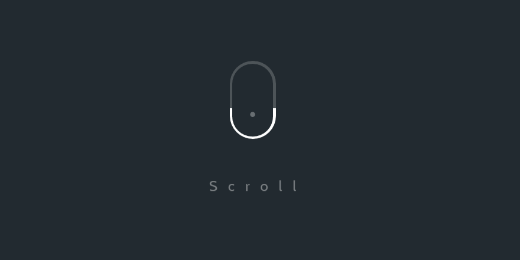

# React With Smooth Scrolling


### A rolagem suave é quando em vez de clicar em um botão e ser imediatamente levado a uma parte diferente da mesma página, o usuário é enviado para lá através de uma animação de rolagem. É um daqueles recursos sutis de IU em um site que fazem uma grande diferença estética.

### Pacote a ser utilizado: 
- [react-scroll - version "^1.7.10](https://www.npmjs.com/package/react-scroll)
- ["AOS - version "^2.3.4"](https://www.npmjs.com/package/aos) para animações


### Instalação

    npm i -S react-scroll
    ou
    yarn add react-scroll

> Importe o pacote react-scroll:

    import { Link, animateScroll as scroll } from "react-scroll";


### src/Components/App.js
```javascript 
import React, { Component } from "react";
import logo from "./logo.svg";
import "./App.css";
import Navbar from "./Components/Navbar";
import Section from "./Components/Section";
import dummyText from "./DummyText";
class App extends Component {
  render() {
    return (
      <div className="App">
        <Navbar />
        <Section
          title="Section 1"
          subtitle={dummyText}
          dark={true}
          id="section1"
        />
        <Section
          title="Section 2"
          subtitle={dummyText}
          dark={false}
          id="section2"
        />
        <Section
          title="Section 3"
          subtitle={dummyText}
          dark={true}
          id="section3"
        />
        <Section
          title="Section 4"
          subtitle={dummyText}
          dark={false}
          id="section4"
        />
        <Section
          title="Section 5"
          subtitle={dummyText}
          dark={true}
          id="section5"
        />
      </div>
    );
  }
}

export default App;
```
## Executar o projeto
- clone this repository
- run `npm install ou yarn`
- run `npm start ou yarn start`

# Resultado
<h1 align="center">
    
</h1>
